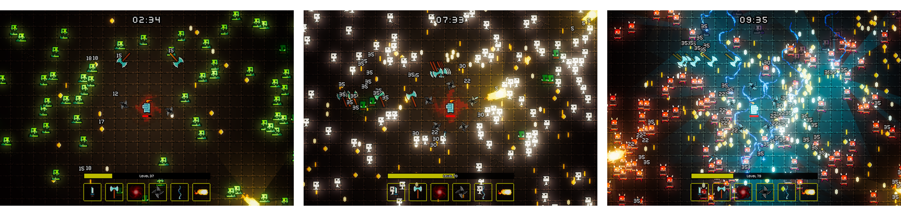
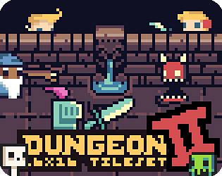
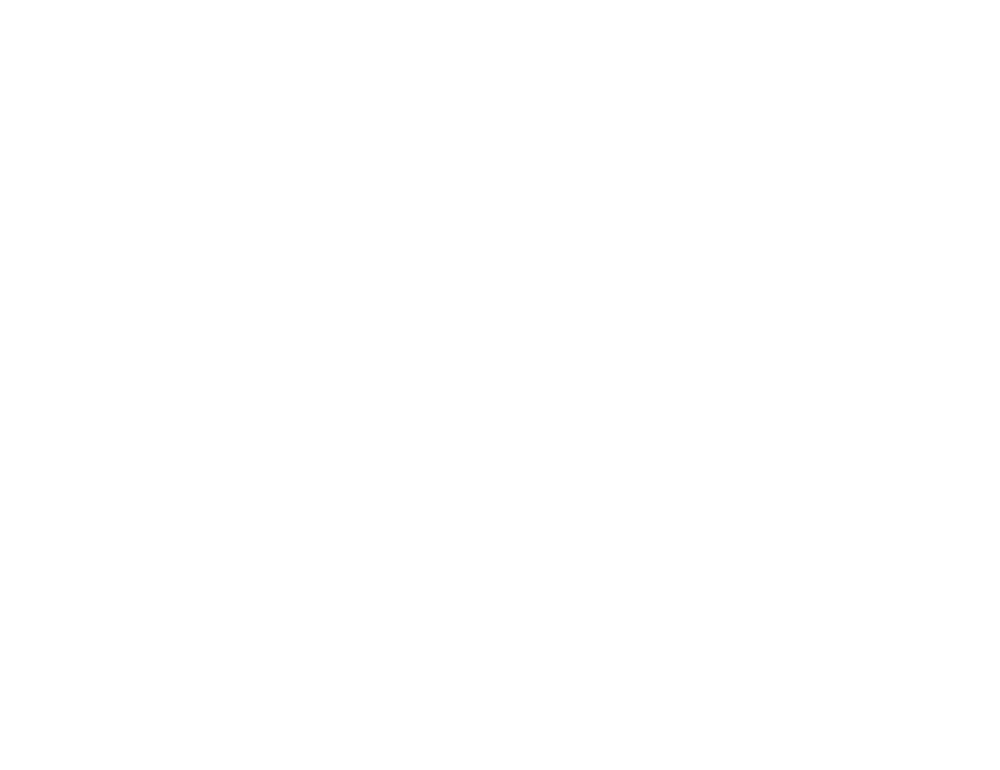

# Unity - 2D - Holberton Survivors 

## 🔖 Table of contents

<details>
        <summary>
		CLICK TO ENLARGE 😇
        </summary>
	    📝 <a href="#description">Description</a>
        <br>
        🔨 <a href="#tech-stack">Tech stack</a>
        <br>
        📂 <a href="#files-description">Files description</a>
        <br>
        📌 <a href="#assets">Assets<a>
        <br>
        💻 <a href="#installation">Installation</a>
        <br>
        🔧 <a href="#whats-next">What's next ?</a>
        <br>
        ♥️ <a href="#thanks">Thanks</a>
        <br>
        👷 <a href="#authors">Authors</a>
</details>

## 📝 <span id="description">Description</span>

### Project Overview:

Holberton Survivors is an action game inspired by the popular title Vampire Survivors. Developed by Yoann Rivet and me, we undertook this project as our end-of-first-year assignment at Holberton School. With no prior experience in Unity and C#, we started from scratch, dedicating one month to preparation and another to intensive coding, learning and implementing these technologies along the way.

### Objective and scope:

The primary goal of Holberton Survivors game is to serve as a learning platform for the essential principles of video game development, focusing on the C# programming language and Unity. We presented this project to a jury to obtain our diploma, validating our first year of learning in programming fundamentals at Holberton Schools. This experience has been invaluable for honing our skills in coding, and project management

### Non-Profit and learning emphasis:

It's important to highlight that Holberton Survivors is a non-profit initiative, primarily undertaken as an educational endeavor. We are still in the early stages of our learning journey, gearing up for a second year of specialization. Yoann will be focusing on the realm of AR/VR, while I am leaning towards machine learning.

Furthermore, to produce this project, we have utilized free-to-use assets such as graphics and music. Despite the extraordinary quality of these assets, for which we extend our gratitude to <a href="https://0x72.itch.io/dungeontileset-ii" target="_blank">Robert Norenberg</a> for distributing such a generous pack, they are not unique. If we were to develop a game for commercial purposes, we would undoubtedly collaborate with a graphic designers to craft a distinct and immersive ambiance.

<p align="center">
    
</p>

## 🔨 <span id="tech-stack">Tech stack</span>

<p align="left">
    
    
    
    
    
    
</p>

## 📂 <span id="files-description">Files description</span>

| FILE            | DESCRIPTION                                                                                               |
| :-------------: | --------------------------------------------------------------------------------------------------------- |
| Assets          | Contains project assets like 2D sprites, scripts, sounds, textures etc.                                   |
| Packages        | May include Unity packages with pre-built code and resources for specific functionalities.                |
| ProjectSettings | Stores project-specific configuration files (import settings, platform settings, quality settings, etc.). |
| resources       | Contains additional materials for the README file.                                                        |
| .gitignore      | Specifies files and folders to be ignored by Git version control.                                         |
| README.md       | The README file you are currently reading ;).                                                             |

## 📌 <span id="assets">Assets</span>

<p align="center">
    <a href="https://0x72.itch.io/dungeontileset-ii" target="_blank">
        
    </a>
    <br>
    By <a href="https://0x72.itch.io/" target="_blank">Robert Norenberg</a> from <a href="https://itch.io/" target="_blank">itch.io</a>
</p>

## 💻 <span id="installation">Installation</span>

### Clone the repository and run from Unity

1. Clone the repository:
    - Open your preferred terminal.
    - Navigate to the directory where you want to clone the repository.
    - Run the following command:
```
git clone https://github.com/fchavonet/unity-2d-holberton_survivors.git
```

2. Open in Unity:
    - Launch Unity Hub.
    - Click on "Add" and select the folder where you cloned the repository.
    - Once added, click on the project to open it in Unity.

3. Run from Unity:
    - In the Unity Editor, navigate to the "Assets" folder.
    - Open the "Scenes" folder.
    - Double-click on the "Title Scene" to open it.
    - Click the "Play" button at the top to run the game in the Unity Editor.

### Download and run the executable

1. Download the game:
    - Visit the project's <a href="https://www.holbertonsurvivors.com/" target="_blank">landing page</a>.
    - Click on the download button, available for both Windows and Mac.
    - For Windows: extract the contents of the downloaded ZIP file to your desired location.
    - For Mac: simply open the downloaded `dmg` image file.

2. a. Run the Game on Windows:
    - Navigate to the extracted folder.
    - Find and run the `Holberton Survivors.exe` executable file.

2. b. Run the game on Mac:
    - In the `dmg` image file, just move the `Holberton Survivors.app` in the Application folder
    - Lauch the game from the Launchpad.

<br>

*Note: ensure that you have the necessary system requirements to run Unity games on your machine.*

### How to play

The game is playable on standard QWERTY and AZERTY keyboards, as well as the most common gamepads on the market, including PS4/5, Switch Pro controllers, and Xbox gamepad.

Below are the illustrated basic controls:

<p align="center">
    
</p>

## 🔧 <span id="whats-next">What's next ?</span>

- 

## ♥️ <span id="thanks">Thanks</span>

A heartfelt thank you to all contributors who provided freely licensed graphics and music for our project. Your generosity has truly enhanced our work, bringing our vision to life.
We would also like to thank our colleagues who accepted to test the game, your feedback has been invaluable.

## 👷 <span id="authors">Authors</span>

**Fabien CHAVONET**
- Github: [@fchavonet](https://github.com/fchavonet)

**Yoann RIVET**
- Github: [@SpStigma](https://github.com/SpStigma)
